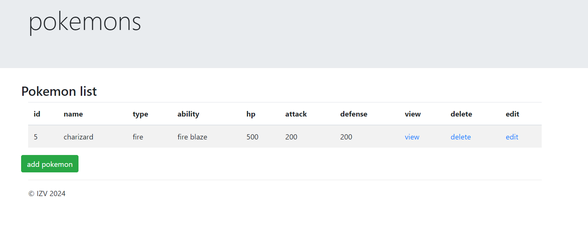
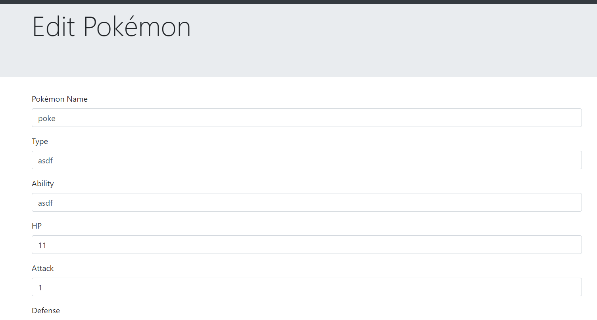

# PokeApp

PokeApp es una aplicación web desarrollada con Laravel que permite a los usuarios explorar y obtener información sobre diferentes Pokémon.

## Requisitos

- PHP >= 7.3
- Composer
- Laravel >= 8.x
- MySQL

## Instalación

1. Clona el repositorio:
    ```bash
    git clone https://github.com/tu-usuario/pokeApp.git
    ```

2. Navega al directorio del proyecto:
    ```bash
    cd pokeApp
    ```

3. Instala las dependencias de Composer:
    ```bash
    composer install
    ```

4. Copia el archivo `.env.example` a `.env` y configura tu base de datos y otras variables de entorno:
    ```bash
    cp .env.example .env
    ```

5. Genera la clave de la aplicación:
    ```bash
    php artisan key:generate
    ```

6. Ejecuta las migraciones de la base de datos:
    ```bash
    php artisan migrate
    ```

7. Inicia el servidor de desarrollo:
    ```bash
    php artisan serve
    ```

## Uso

Una vez que el servidor esté en funcionamiento, puedes acceder a la aplicación en `http://localhost:8000`.

## Diseño interfaz
Aquí podemos encontrar la interfaz de la app donde veremos los pokemon listados y solo podemos editar o borrar si estamos logeados


Aquí el formulario de edición
